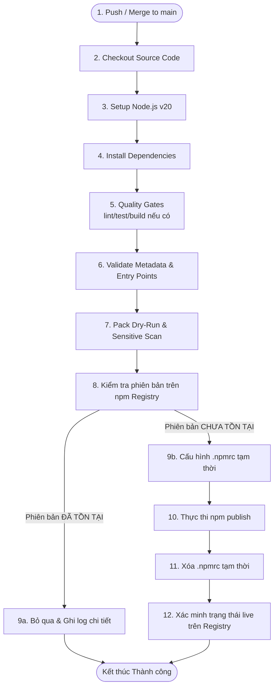

# Kiến trúc và Giải pháp Tự động hóa Publish npm Package

Tài liệu này tổng hợp giải pháp kiến trúc, quy trình xử lý và các biện pháp khắc phục sự cố kỹ thuật trong quá trình triển khai CI/CD tự động hóa việc xuất bản (publish) package lên npm Registry thông qua GitHub Actions.

---

## 1. Tổng quan Luồng xử lý (Workflow Architecture)

Sơ đồ dưới đây mô tả chi tiết quy trình xử lý của CI/CD khi có sự kiện đẩy mã nguồn lên nhánh `main`:



---

## 2. Chi tiết các Bước trong Quy trình

### Bước 1 $\rightarrow$ 5: Khởi tạo và Chuẩn bị
* **Checkout & Setup Node.js**: Hệ thống sử dụng runner `ubuntu-latest`, thiết lập môi trường Node.js v20 và trỏ registry mặc định tới `https://registry.npmjs.org`.
* **Cài đặt Dependencies**: Quy trình hỗ trợ linh hoạt. Nếu có `package-lock.json` sẽ dùng `npm ci` để tối ưu hiệu năng; ngược lại sẽ dùng `npm install`.
* **Quality Gates**: Tự động chạy `npm run lint`, `npm test`, và `npm run build` dưới dạng `--if-present` (chỉ chạy nếu các script này được khai báo trong `package.json`).

### Bước 6 & 7: Kiểm thử tĩnh và Bảo mật (Validation & Dry-Run)
* **Xác thực cấu trúc `package.json`**:
  * Kiểm tra sự tồn tại của trường `name`, `version`, đảm bảo package không ở chế độ private.
  * Xác minh tính hợp lệ của định dạng tên và phiên bản (chuẩn SemVer) bằng mã JavaScript chạy trong Node.js để tránh các lỗi locale của Bash.
  * Tự động quét xem các file định nghĩa trong trường `main` và `bin` có thực sự tồn tại trong thư mục dự án hay không.
* **Đóng gói thử (`npm pack --dry-run`)**: Chạy lệnh tạo gói thử và kiểm tra danh sách tệp sẽ xuất bản. Pipeline sẽ chủ động dừng và báo lỗi nếu phát hiện các tệp tin nhạy cảm như `.env`, `secret`, `credential`.

### Bước 8 $\rightarrow$ 11: Kiểm tra phiên bản và Phát hành (Publish)
* **Kiểm tra trạng thái phiên bản**: Thực hiện truy vấn `npm view <package>@<version> version`. Nếu phiên bản trùng khớp với `package.json`, luồng sẽ chuyển sang trạng thái **SKIPPED** và ghi log rõ ràng, không làm hỏng pipeline.
* **Ghi cấu hình `.npmrc` tạm thời**: Để tránh các lỗi phát sinh do cấu hình tự động `NODE_AUTH_TOKEN` của `setup-node`, pipeline tự tạo file `.npmrc` trong thư mục làm việc chứa Auth Token:
  ```bash
  echo "//registry.npmjs.org/:_authToken=${NPM_TOKEN}" > .npmrc
  ```
* **Phát hành công khai**: Tự động phát hiện nếu package là dạng scoped (bắt đầu bằng `@`) để bổ sung tham số `--access public` nếu cần.
* **Dọn dẹp bảo mật**: Chạy lệnh `rm -f .npmrc` ngay lập tức sau khi publish để đảm bảo không lưu lại thông tin nhạy cảm.

### Bước 12: Xác minh trạng thái hoạt động (Verify Live)
* Gửi các truy vấn HTTP trực tiếp qua Node.js tới đường dẫn API của npm Registry.
* Sử dụng tham số chống cache (Cache-Busting) bằng cách đính kèm timestamp ngẫu nhiên (`?t=Date.now()`) để bỏ qua bộ nhớ đệm CDN của Fastly.
* Thực hiện tối đa **12 lần thử**, mỗi lần cách nhau **10 giây** (tổng thời gian 2 phút) để chờ quá trình đồng bộ hóa giữa các node của npm Registry hoàn tất.

---

## 3. Các Giải pháp Kỹ thuật và Bài học Kinh nghiệm

### 3.1. Lỗi định dạng tên Package trên Bash
* **Vấn đề**: Regex của Bash `[[ ! "$NAME" =~ ... ]]` khi xử lý nhóm ký tự `[a-z0-9-~]` thường bị lỗi diễn giải dấu gạch ngang `-` tùy theo thiết lập locale của runner, khiến các package bắt đầu bằng số như `3a-factory` bị báo lỗi định dạng không hợp lệ.
* **Giải pháp**: Chuyển toàn bộ các bước so khớp Regex phức tạp trong shell script sang thực thi bằng Node.js (`RegExp.test`).

### 3.2. Lỗi Yêu cầu Xác thực 2 yếu tố (`EOTP`)
* **Vấn đề**: Tài khoản hoặc package bật 2FA cho lệnh publish sẽ khiến pipeline tự động bị từ chối do không thể nhập mã OTP trực tiếp.
* **Giải pháp**: 
  1. Hướng dẫn người dùng tạo **Classic Token** trên npm Registry với phân loại **Automation** (loại token được thiết kế riêng để bỏ qua yêu cầu nhập mã OTP khi chạy CI/CD).
  2. Tạo GitHub Secret cấp độ **Environment** (`npm-production`) hoặc cấp độ **Repository** để bảo mật token này.

### 3.3. Lỗi Xác minh thất bại do độ trễ CDN (CDN Propagation Delay)
* **Vấn đề**: Lệnh `npm publish` báo thành công nhưng bước kiểm tra `npm view` ngay sau đó vẫn trả về phiên bản cũ do CDN Registry chưa đồng bộ kịp, làm thất bại pipeline.
* **Giải pháp**:
  1. Thay thế lệnh `npm view` bằng request HTTP GET trực tiếp tới `https://registry.npmjs.org/<package>/<version>?t=<timestamp>` để phá cache CDN.
  2. Tăng khoảng thời gian kiểm tra tối đa lên 2 phút (12 lần thử, giãn cách 10 giây).

---

## 4. Hướng dẫn Vận hành và Cấu hình

### 4.1. Khởi tạo Secrets trên GitHub
1. Vào `Settings` $\rightarrow$ `Environments` $\rightarrow$ Tạo environment tên là `npm-production`.
2. Trong environment vừa tạo, thêm một secret tên là `NPM_TOKEN` chứa mã khóa **Automation Token** lấy từ npmjs.com.

### 4.2. Cập nhật Phiên bản
Mỗi khi cần phát hành phiên bản mới:
1. Thực hiện thay đổi code.
2. Nâng giá trị `"version"` trong tệp `package.json` theo đúng chuẩn SemVer (ví dụ: `1.0.10`).
3. Commit và push/merge vào nhánh `main`. Quy trình CI/CD sẽ tự động thực hiện các bước còn lại.
