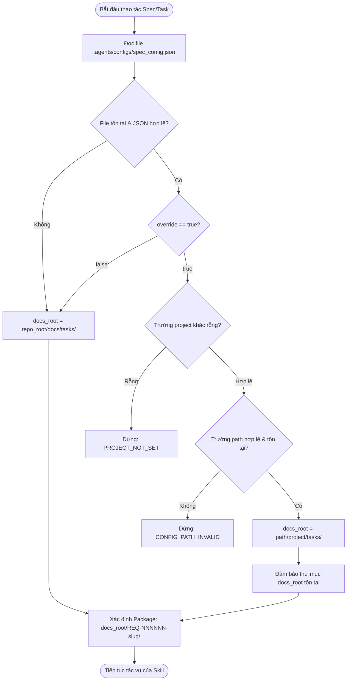
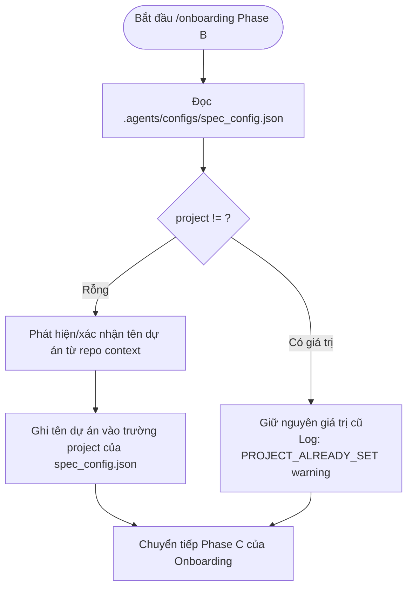

# REQ-000001-spec-config-override Design (How)

> Authoritative: **Technical Truth — HOW**
> Spec Package path: `docs/tasks/REQ-000001-spec-config-override/design.md`

## Metadata

- REQ ID: REQ-000001
- Feature: Cải tiến cơ chế tạo spec với spec_config.json override path
- Package path: `docs/tasks/REQ-000001-spec-config-override/`
- Date: 2026-09-09
- Analysis ref: `analysis.md`
- Requirements ref: `requirements.md`
- Related ADR: `ADR_NOT_REQUIRED` (đã phân tích trong `analysis.md`, tính năng là additive configuration)

## Phase question

Làm thế nào để hỗ trợ cơ chế chuyển hướng (redirect) thư mục lưu trữ Spec Package sang `<path>/<project>/tasks/REQ-*` một cách đồng bộ, an toàn, bất biến với tên project và tương thích ngược hoàn toàn trên toàn bộ hệ thống kỹ năng của 3a-factory?

## Requirement references

- FR-001: Khởi tạo file spec_config.json mặc định
- FR-002: Phân giải đường dẫn tài liệu theo cấu hình
- FR-003: Onboarding gán tên project và khóa bất biến
- FR-004: Kiểm tra tính hợp lệ và fail-fast
- FR-005: Đồng bộ hóa toàn bộ kỹ năng và tài liệu điều phối
- BR-001: Ưu tiên fallback an toàn về repo cục bộ
- BR-002: Tính bất biến của Project Identifier
- NFR-001: Tương thích ngược tuyệt đối
- NFR-002: Chuẩn hóa đường dẫn tương thích đa hệ điều hành

## Solution approach

### DES-ARCH-001 — Kiến trúc Centralized Contract-Driven Path Resolver

Thay vì cài đặt các script xử lý đường dẫn phân tán hoặc viết module code phức tạp trong các môi trường agent khác nhau, 3a-factory sử dụng nguyên tắc **Contract as Single Source of Truth**:
1. **Hợp đồng chuẩn hóa**: Định nghĩa một chuẩn xử lý đường dẫn tập trung trong `.agents/contracts/spec-package.md` tại mục `§ 5.9 Path Resolution (spec_config override)`.
2. **Cấu hình chuẩn hóa**: Cung cấp file `.agents/configs/spec_config.json` làm nguồn dữ liệu trạng thái cấu hình.
3. **Tuân thủ quy chuẩn (Skill Adherence)**: Tất cả 14+ kỹ năng trong `.agents/skills/` được cập nhật quy tắc tham chiếu tới § 5.9 để tự tính toán `docs_root`.
4. **Scaffolding tự động**: Trình cài đặt `scripts/install.js` tự động copy file cấu hình mẫu mặc định khi setup pipeline vào bất kỳ repo nào.

## Modules / main flows

### DES-FLOW-001 — Quy trình Phân giải Đường dẫn (Path Resolution Flow)



Chi tiết thuật toán:
1. Đọc `.agents/configs/spec_config.json`.
2. Nếu không tìm thấy file hoặc parse lỗi JSON: fallback an toàn về `<repo_root>/docs/tasks/`.
3. Nếu `override == false`: trả về `<repo_root>/docs/tasks/`.
4. Nếu `override == true`:
   - Nếu `project` rỗng hoặc không phải chuỗi: trả lỗi `PROJECT_NOT_SET`.
   - Nếu `path` rỗng, chứa ký tự rỗng, hoặc đường dẫn không tồn tại: trả lỗi `CONFIG_PATH_INVALID`.
   - Chuẩn hóa `path`: loại bỏ trailing separator (`/` hoặc `\`).
   - Xác định `docs_root = path.join(path, project, "tasks")`.
   - Tạo thư mục nếu chưa có.

### DES-FLOW-002 — Quy trình Onboarding thiết lập Project Name và Khóa Bất biến



Quy tắc bất biến:
- Agent khi thực thi `onboarding` chỉ được ghi vào trường `project` nếu giá trị hiện tại là `""`.
- Khi `project` đã có giá trị, bất kỳ yêu cầu đổi tên nào trong quy trình tự động đều bị từ chối với thông báo cảnh báo `PROJECT_ALREADY_SET`.

## Config design

### DES-DATA-001 — Cấu trúc dữ liệu `spec_config.json`

File vị trí: `.agents/configs/spec_config.json`
Định dạng JSON Schema nội bộ:

```json
{
  "$schema": "https://json-schema.org/draft/2020-12/schema",
  "title": "SpecConfig",
  "type": "object",
  "additionalProperties": false,
  "required": ["override", "project", "path"],
  "properties": {
    "override": {
      "type": "boolean",
      "description": "Kích hoạt chuyển hướng thư mục tài liệu spec ra ngoài repository",
      "default": false
    },
    "project": {
      "type": "string",
      "description": "Tên định danh dự án, được thiết lập một lần khi onboarding và bất biến sau đó"
    },
    "path": {
      "type": "string",
      "description": "Đường dẫn gốc tới thư mục knowledge base tập trung bên ngoài repo"
    }
  }
}
```

Mẫu khởi tạo (Scaffold template):
```json
{
  "override": false,
  "project": "",
  "path": ""
}
```

## Security design

### DES-SEC-001 — Kiểm soát Đường dẫn và An toàn Truy cập

1. **Path Traversal Check**: Khi kiểm tra trường `path`, kiểm tra giá trị không chứa các chuỗi nguy hiểm cố ý thoát thư mục gốc hệ thống ngoài ý muốn.
2. **Access Control**: Khi `override == true`, agent kiểm tra quyền đọc/ghi bằng cách kiểm tra sự tồn tại của thư mục hoặc tạo thử thư mục nếu cần. Nếu gặp lỗi phân quyền (EACCES/EPERM), trả về lỗi `CONFIG_PATH_INVALID`.
3. **Repository Containment**: File cấu hình `spec_config.json` và toàn bộ mã nguồn pipeline `.agents/` luôn được giữ an toàn bên trong repo, không bị ghi đè hay chuyển ra ngoài.

## Observability design

### DES-OBS-001 — Hệ thống Token Báo lỗi và Logging Thống nhất

Khi quá trình phân giải đường dẫn gặp sự cố, hệ thống phát sinh các token lỗi chuẩn sau:

| Token | Mức độ | Ý nghĩa | Hành động của Agent |
|---|---|---|---|
| `CONFIG_MALFORMED` | Warning/Error | File JSON lỗi cú pháp | Dừng lại báo người dùng sửa JSON hoặc fallback theo BR-001 |
| `PROJECT_NOT_SET` | Blocker | `override: true` nhưng thiếu tên project | Báo người dùng chạy `/onboarding` hoặc cấu hình project |
| `CONFIG_PATH_INVALID` | Blocker | Đường dẫn `path` không tồn tại/không truy cập được | Báo người dùng kiểm tra đường dẫn hoặc cấp quyền |
| `PROJECT_ALREADY_SET` | Warning | Thao tác cố ghi đè giá trị project đã có | Không ghi đè, ghi nhận cảnh báo và tiếp tục |

## Migration design

### DES-MIG-001 — Tương thích ngược và Chuyển dịch cấu hình

- Các repository đang chạy phiên bản cũ của 3a-factory khi nâng cấp qua installer:
  - Nếu `.agents/configs/spec_config.json` chưa có -> Installer sẽ tạo mới với `override: false`.
  - Nếu đã có file -> Giữ nguyên, không ghi đè mất cấu hình của người dùng.
- Không phát sinh yêu cầu di chuyển dữ liệu (data migration).

## Minimum file/module scope (required)

### 1. Template & Installer Scope
- `.agents/configs/spec_config.json` — file mẫu cấu hình mặc định (FR-001)
- `scripts/install.js` — thêm `.agents/configs/spec_config.json` vào danh sách `sharedFiles` (FR-001)

### 2. Contract & Governance Scope
- `.agents/contracts/spec-package.md` — bổ sung mục § 5.9 quy định thuật toán phân giải đường dẫn và tính bất biến của project (FR-002, FR-003, BR-001, BR-002)
- `AGENTS.md` — cập nhật Canonical path: hỗ trợ path override qua spec_config (FR-005)
- `GEMINI.md` — cập nhật Canonical path & hướng dẫn spec_config (FR-005)
- `CLAUDE.md` — cập nhật Canonical path & hướng dẫn spec_config (FR-005)

### 3. Skills Scope (Path Resolution)
- `.agents/skills/triage/SKILL.md` — cập nhật Package resolution contract & khởi tạo thư mục tại docs_root (FR-002, FR-004)
- `.agents/skills/analyze/SKILL.md` — cập nhật Package resolution contract (FR-002)
- `.agents/skills/requirements/SKILL.md` — cập nhật Package resolution contract (FR-002)
- `.agents/skills/design/SKILL.md` — cập nhật Package resolution contract (FR-002)
- `.agents/skills/tasks/SKILL.md` — cập nhật Package resolution contract (FR-002)
- `.agents/skills/acceptance/SKILL.md` — cập nhật Package resolution contract (FR-002)
- `.agents/skills/adr/SKILL.md` — cập nhật Package resolution contract (FR-002)
- `.agents/skills/spec/SKILL.md` — cập nhật Package resolution contract (FR-002)
- `.agents/skills/spec-review/SKILL.md` — cập nhật Package resolution contract (FR-002)
- `.agents/skills/develop/SKILL.md` — cập nhật Package resolution contract & evidence paths (FR-002)
- `.agents/skills/review/SKILL.md` — cập nhật Package resolution contract & evidence paths (FR-002)
- `.agents/skills/qa/SKILL.md` — cập nhật Package resolution contract & evidence paths (FR-002)
- `.agents/skills/converge/SKILL.md` — cập nhật Package resolution contract (FR-002)
- `.agents/skills/project-manager/SKILL.md` — cập nhật Package resolution contract & Onboarded detection note (FR-002)

### 4. Onboarding Skill Scope
- `.agents/skills/onboarding/SKILL.md` — cập nhật Phase B: điền tên project khi rỗng, áp dụng guard bất biến không ghi đè (FR-003)

## Acceptance impact

- AC-001: Installer tạo spec_config.json mặc định
- AC-002: Path resolution tuân thủ override false và true
- AC-003: Onboarding thiết lập project và khóa không ghi đè
- AC-004: Xử lý lỗi fail-fast với CONFIG_PATH_INVALID và PROJECT_NOT_SET
- AC-005: Toàn bộ 15 skill và governance docs được đồng bộ thống nhất

## Traceability matrix

| Requirement | Design IDs | Ghi chú |
|---|---|---|
| FR-001 | DES-ARCH-001, DES-DATA-001 | Installer & Template cấu hình |
| FR-002 | DES-ARCH-001, DES-FLOW-001 | Thuật toán phân giải đường dẫn |
| FR-003 | DES-FLOW-002 | Onboarding & Khóa bất biến project |
| FR-004 | DES-SEC-001, DES-OBS-001 | Validation & Error tokens |
| FR-005 | DES-ARCH-001, Minimum File Scope | Đồng bộ hóa toàn diện 20 file |
| BR-001 | DES-FLOW-001 | Fallback an toàn về repo cục bộ |
| BR-002 | DES-FLOW-002 | Nguyên tắc bất biến định danh dự án |
| NFR-001 | DES-MIG-001 | Đảm bảo tương thích ngược |
| NFR-002 | DES-FLOW-001 | Chuẩn hóa dấu phân cách path |

## Risks & short rollback

- **Rủi ro**: Một số công cụ hoặc editor không tìm thấy tài liệu nếu người dùng mở riêng repository mà không mở folder knowledge base ngoài.
  - *Giảm thiểu*: Ghi rõ tài liệu hướng dẫn trong `AGENTS.md` và thông báo đường dẫn đầy đủ trong phản hồi của PM.
- **Rollback**: Đặt `override: false` trong `.agents/configs/spec_config.json`, hệ thống ngay lập tức trở về hoạt động cục bộ 100% mà không cần sửa code.
