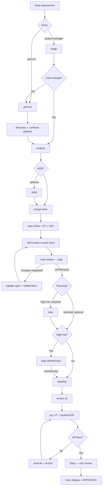

# 3A Factory

## Lifecycle

## Dual mode
- **`/project-manager`**: auto-run pipeline; if unclear → `grill-me`; when clear or “execute now” → continue without asking again. **Exception:** always stop after spec for user `APPROVED`.
- **`/grill-me`**: deep clarification; same handoff rules into the pipeline.

## Deploy
Always separate from PM. After QA Pass + **user review** of UT/QA evidence, user runs `/deploy <env>` and must **`APPROVED`** before execution.

## Directives
- **`APPROVED`**: after **every** spec (all risk levels) before plan/develop; before develop when risk is **high**; before every deploy.
- **`REJECTED`** / **`RE-EXECUTE`**: approval gate / refine current artifact (and related prior docs when adjusting after spec review).

## Spec review gate
After writing `…-spec.md`, the agent must:
1. Ensure **Acceptance Criteria**, **System Test Conditions**, and **UAT Conditions** are present and verifiable.
2. Self-evaluate the spec against raw / discovery / analysis / design / ADR.
3. Ask the user to verify and point out adjustments if needed.
4. Apply updates to the spec and related prior documents when requested.
5. Continue only after explicit `APPROVED`.

## QA gate
After develop/review, QA must:
1. Author unit tests + write `docs/qa/REQ-<NNNNNN>-<slug>-UT.md`.
2. Run tests with real evidence; write `docs/qa/REQ-<NNNNNN>-<slug>-qa.md`.
3. Verify every **System Test** and **UAT** condition from the approved spec.
4. Auto-fix and re-test until all Pass (no fixed round cap), unless blocked.
5. Stop for **user review** — do not deploy.

## Artifacts
`docs/requirements|designs|reviews|qa|release-notes` — see `AGENTS.md`.  
Generated artifact **content** must be **Vietnamese**; this workflow file stays English.

## Tool mapping
| Tool | Native files | Notes |
|---|---|---|
| Claude Code | `.claude/skills`, `.claude/commands`, `CLAUDE.md` | Skills first-class; commands are wrappers |
| Gemini CLI | `.gemini/skills`, `.gemini/commands/*.toml`, `GEMINI.md` | Skills + TOML slash commands |
| Cursor | `.cursor/skills`, `.cursor/rules/ai-workflow.mdc` | Skills = slash commands (`/project-manager`, …); `ai-workflow` rule always applies |
