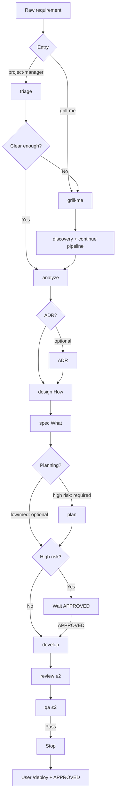

# 3A Factory

## Lifecycle

## Dual mode
- **`/project-manager`**: auto-run pipeline; if unclear → `grill-me`; when clear or “execute now” → continue without asking again.
- **`/grill-me`**: deep clarification; same handoff rules into the pipeline.

## Deploy
Always separate from PM. After QA Pass, user runs `/deploy <env>` and must **`APPROVED`** before execution.

## Directives
- **`APPROVED`**: before develop (high risk) and before every deploy.
- **`REJECTED`** / **`RE-EXECUTE`**: approval gate / refine current artifact.

## Artifacts
`docs/requirements|designs|reviews|qa|release-notes` — see `AGENTS.md`.  
Generated artifact **content** must be **Vietnamese**; this workflow file stays English.

## Tool mapping
| Tool | Native files | Notes |
|---|---|---|
| Claude Code | `.claude/skills`, `.claude/commands`, `CLAUDE.md` | Skills first-class; commands are wrappers |
| Gemini CLI | `.gemini/skills`, `.gemini/commands/*.toml`, `GEMINI.md` | Skills + TOML slash commands |
| Cursor | `.cursor/skills`, `.cursor/rules/ai-workflow.mdc` | Skills = slash commands (`/project-manager`, …); `ai-workflow` rule always applies |
